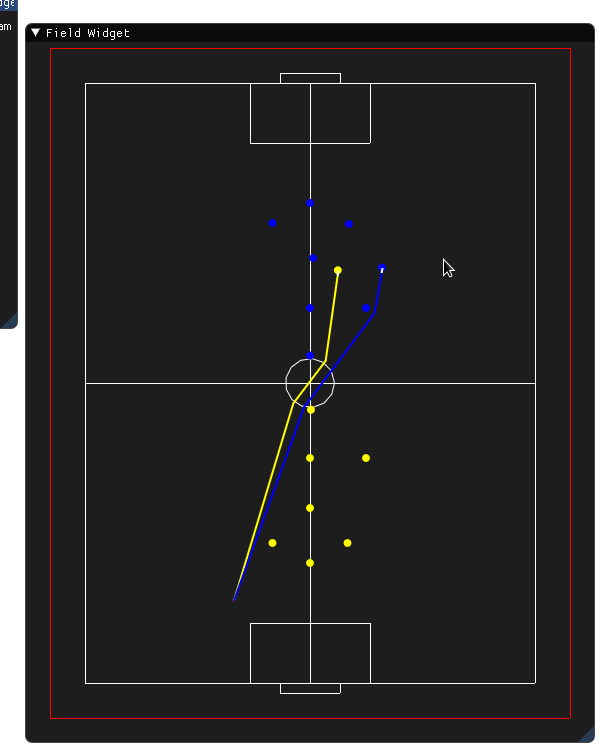

# CISE483-Robot-Football

Code Structure
==============

#### Network.py

This class is responsible for the communication between our code and the
simulator over a UDP socket. It ensures that we always receive the
latest packet from the simulator.

#### Playground.py

This class will keep our local representation of what happens inside the
simulator. It will also update each component in our system when we
receive a new frame from the simulator through the Network class. It
also contains our custom GUI to show the path planned by our algorithms
as a visual representation.

#### robot.py

This is the main functioning class in our project and is the most
relevant in the context of CISE 483. It contains our implementation of
both aforementioned algorithms as well as our simple kinematic
controller, which is relevant to what we studied in CISE 480. The
implementation of the STOx planner is distributed throughout the
following functions:

-   **Planner:** This is the main STOx planner implementation. It
    contains the recursive function that will be invoked by the robot
    instance with the given parameters.

-   **get\_obstacles:** This function will check a line against a group
    of obstacles using the overlap function.

-   **overlap** This function will check if a line intersects with a
    circle by doing two checks. Firstly it check if the circle center
    inside the rectangle formed by the line vertices and if it is inside
    it performs the second check. The second check is done by
    calculating the normal between the circle’s center and the line. If
    the distance is less than the circle’s radius then there is a
    collision. These calculations assume that the radius of the circle
    is less than the height or width of the formed rectangle which is
    mostly true in the context of the robocup where the robot radius is
    usually around 80cm.

-   **get\_sub\_goal** this function calculate the position of the
    sub-goal. first it finds the point of intersection then finds a
    perpendicular vector from the point of intersection . finally using
    this vector we calculate the sub-goal position by adding it to the
    point of intersection.

    $$X = X_{intersection} + v_{x} * d$$

    $$Y = Y_{intersection} + v_{y} * d$$

    *where d is the distance between the sub-goal to the line.*

-   **move\_to and move\_to\_RRT** These are the main functions that are
    called to move the robot to a specific position. They are
    practically identical, except that move\_to uses the STOx planner
    and move\_to\_RRT uses the RRT algorithm. One other difference is
    that we pass the playground directly in the case of move\_to\_RRT
    which is not how it is supposed to be done but we did this for
    debugging purposes. Robots within the simulator accept commands in
    the form of tangential and normal velocities, or $V_x$ and $V_y$, so
    after a path is returned from the respective algorithms a conversion
    is performed from the individual path positions into velocity
    commands that can be accepted by the robot. These velocities are
    with respect to the robot frame while the planned path is with
    respect to the world’s frame. To turn a path into a velocity
    commands first split the path into line segments. Then find out
    which segment of the path the robot is currently in. After that
    create a unit vector parallel with the incoming line segment and
    finally transform the vector with the specified magnitude into the
    robot frame using the rotation matrix.

-   **RRT** This is the main function that performs the RRT algorithm.
    It takes the start and goal positions as parameters, as well as the
    Playground object for GUI representation as well as for debugging.
    We start by initializing the tree with the start node. Then while
    the distance to the goal is greater than a defined threshold we call
    the extend function which adds a new node to the tree and returns
    the distance to that new node to the goal. After building the tree
    we need to return the planned path. This is done by iterating from
    the goal node to the start node by accessing the parent nodes. We
    finally reverse the path (since we have started from the goal and
    have stopped at the start node), and finally return that path.

-   **extend** The extend function is the main definitive function for
    the RRT algorithm. It extends the current version of the tree by one
    new node based on a random position in the general direction of the
    goal. First a random position in the field is generated, and the
    nearest node in the tree to the goal is obtained. A unit vector from
    the obtained nearest node and in the direction of the random
    position is then computed and the tree is extended with a new node
    in the direction of this unit vector and with a fixed specified
    magnitude. The current nearest node is assigned as a parent to this
    new node and the new node is added to the tree, extending from the
    assigned nearest node parent. The distance of this new node to the
    goal is finally returned. In retrospect and after already completing
    this function’s implementation, we believe that finding a unit
    vector in a random direction might be a more efficient approach in
    terms of performance but the approach we have used works also.

#### Node.py

This class defines a general structure for a node to be used as a
building block for the tree in the RRT algorithm. It consists of a
position and the parent node. The position is used to indicate the
coordinate of the node within the field, and the parent denotes the
previous node from which this current one extends from. The reason for
including the parent is that we obtain the planned path from the tree by
iterating backwards through the parents starting from the goal node
until we reach the start node. The returned planned path is the reversal
of this computed path.

#### Astar.py

In the code of A\* star, we defined many functions. In this section, we
will explain these functions and the use of each function.

-   *h(p1, p2) :* This function is used to find the heuristic distance
    between current point and the target point. Its inputs are *p1*
    (current state position) and p2 (target state position)

-   *reconstruct\_path(came\_from, current, draw)*: This function is
    defined to construct the optimal path as we got to the goal. Its
    inputs are *came\_from* (an array that saves all the states that
    have been visited to reach current state), *current* (it has the
    location of current state (goal usually) and *draw* (to draw the
    path between came\_from and current))

-   *algorithm(draw, grid, start, end)* : This is the most important
    function is the program. It contains the algorithm of A\*. It
    calculates the f function of A\* and decides next states we should
    go to.

-   *make\_grid(rows, width)* : it divides the screen of *pygame* with
    certain rows and width.

-   *draw\_grid(win, rows, width) *: it draws the grid line that are
    divided by *make\_grid* in pygame screen

-   *draw(win, grid, rows, width)* : it draw the paths which are made by
    algorithm

-   *get\_clicked\_pos(pos, rows, width)* : this is used to get the
    position from the mouse (clicks) of the obstacles, start and end
    points

-   *main(win, width)* : this the main function of the program and it
    combines all of the above functions

 Markup : 1. Videos
 
              1. https://drive.google.com/file/d/139gagdViW3cRIkW5W3tC0eFJgXZZK6vY/view?usp=sharing
              
              2. https://drive.google.com/file/d/10d1ybsl2RCNm7VsFDE9PkI2Qjc_CmbUt/view?usp=sharing
              
              3. https://drive.google.com/file/d/1tCYXDVyQFSjOdAWjFbYhMgt9Y_nSAg-h/view?usp=sharing
              
              4. https://drive.google.com/file/d/1VJxYot0oW80sLj-h4NEsxAzWIZbkiLos/view?usp=sharing

